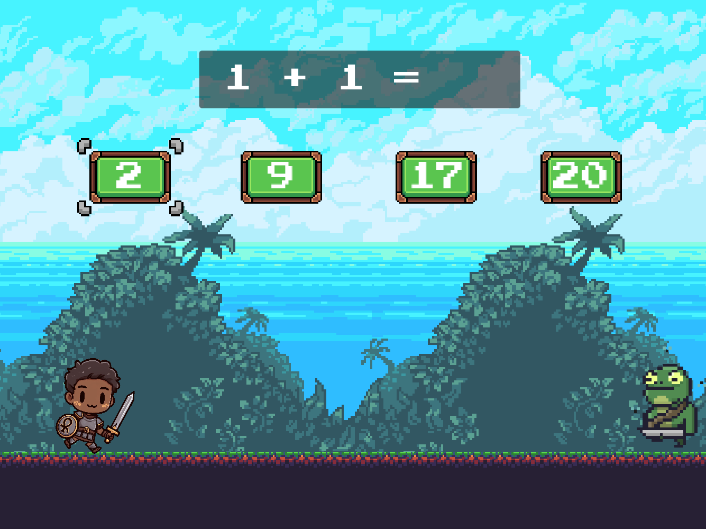
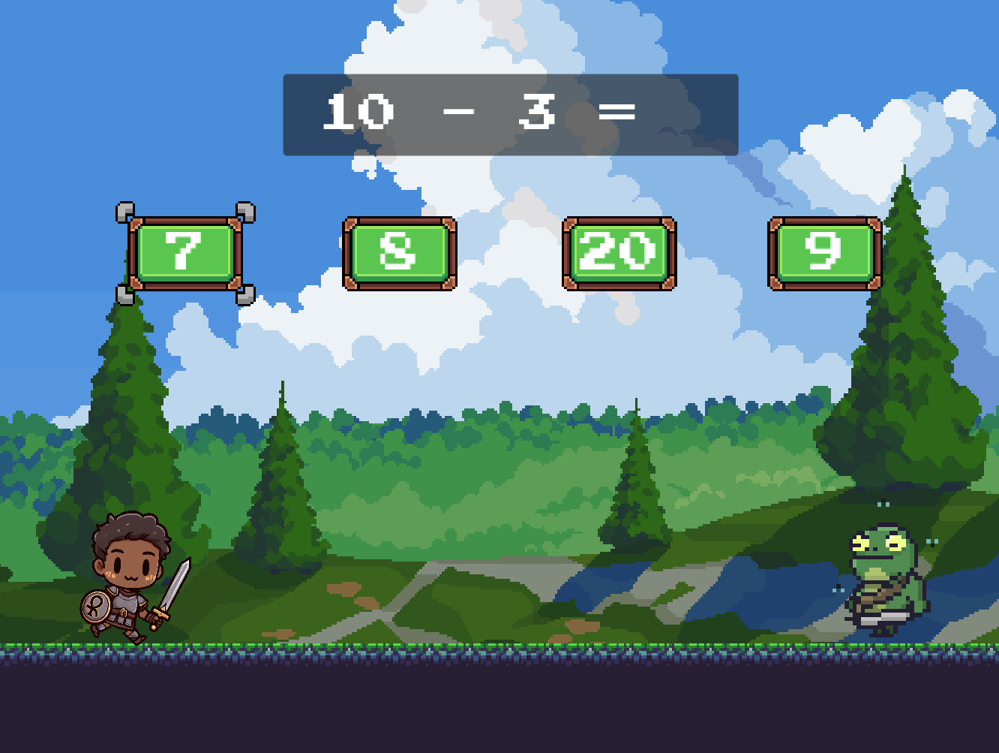
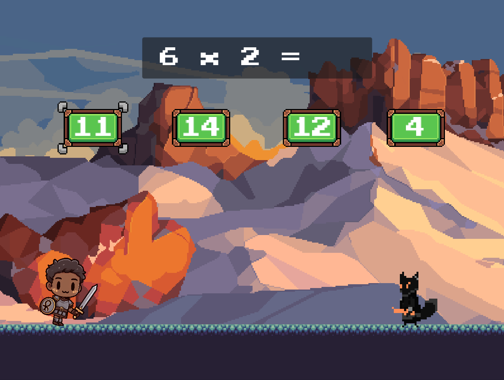
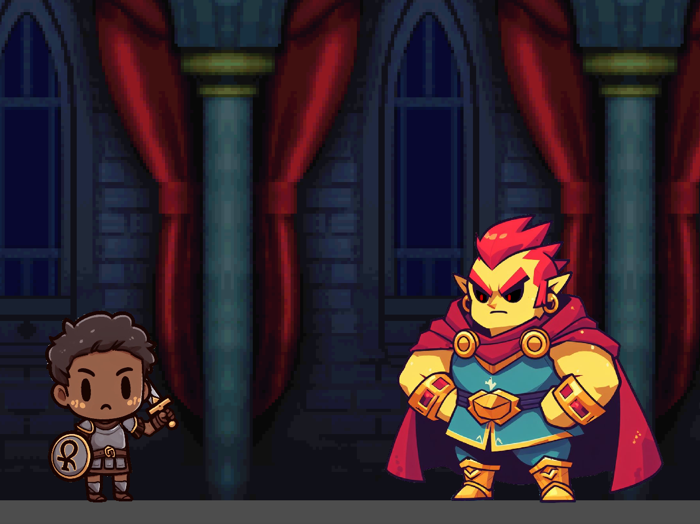

# The Legend of Samir

Um jogo educacional sobre Matemática para crianças do 3º ano do Ensino Fundamental. Feito para um projeto da disciplina de Experimentação de Protótipos do curso de Ciência da Computação na Universidade de Fortaleza.

O jogo visa ensinar as 4 operações básicas da Matemática de forma divertida e envolvente. Além disso, o jogo também ensina comparações numéricas, o que desenvolve ainda mais o raciocínio lógico rápido de quem joga.

O jogo conta com 4 níveis, cada um com uma operação diferente para praticar. E uma batalha final para revisar tudo o que foi visto, derrotando assim o grande vilão Euler.

## Galeria

|||
|------|-------|
|||

## Execução

O projeto foi criado utilizando a **Godot Game Engine** na **versão 4.0.3**, mas o projeto pode ser importado para versões superiores sem problema.

## Autores
- João Felipe Ribeiro
- Samir Alves Albano
- Erich Lima Schlaepfer

## Links
- [Página do jogo no itch.io](https://lapadagames.itch.io/the-legend-of-samir)
- [Godot](https://godotengine.org/)

## Licença

MIT License  
Copyright (c) 2023 Lapada Games